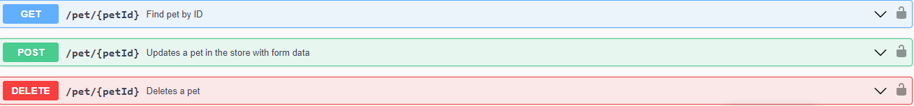

# Enuygun&Patika Test Automation Bootcamp Final Homework

Proje 3 kısımdan oluşmaktadır. Bunlar:

1-Selenium ile Enuygun.com sitesinden uçak bileti alma işleminin otomasyonunun yapıldığı ve testlerinin yapıldığı kısım,

2-Ödev için verilen requestler doğrulutsunda api testlerinin yazıldığı kısım,

3-[patikaapiium.apk](https://github.com/malierbay9/enuygun-patika-bootcamp-final-homework/blob/main/src/test/resources/app/patikaappium.apk) mobil uygulamasına ait otomasyon ve testlerin olduğu kısımlardır.

## 1- Flight Ticket Case

Bu kısıma ait dosyalar [flight_ticket_case](https://github.com/malierbay9/enuygun-patika-bootcamp-final-homework/tree/main/src/test/java/flight_ticket_case) paketinin içindedir.

#### [util](https://github.com/malierbay9/enuygun-patika-bootcamp-final-homework/tree/main/src/test/java/flight_ticket_case/util) Paketi

- [PropertyReader](https://github.com/malierbay9/enuygun-patika-bootcamp-final-homework/blob/main/src/test/java/flight_ticket_case/util/PropertyReader.java) sınıfı, [enuygun_config.yaml](https://github.com/malierbay9/enuygun-patika-bootcamp-final-homework/blob/main/src/test/resources/enuygun_config.yml) dosyasından property okumayı sağlayan sınıftır. Okuduğu propertyleri [ConfigProperties](https://github.com/malierbay9/enuygun-patika-bootcamp-final-homework/blob/main/src/test/java/flight_ticket_case/util/ConfigProperties.java) sınıfına çevirir.

- [ConfigProperties](https://github.com/malierbay9/enuygun-patika-bootcamp-final-homework/blob/main/src/test/java/flight_ticket_case/util/ConfigProperties.java) sınıfından driver propertylerini elde ederiz.

- [DriverOptions](https://github.com/malierbay9/enuygun-patika-bootcamp-final-homework/blob/main/src/test/java/flight_ticket_case/util/DriverOptions.java) sınıfı, driver capabilitylerini kullanmak üzere elde ettiğimiz sınıftır.

- [DriverFactory](https://github.com/malierbay9/enuygun-patika-bootcamp-final-homework/blob/main/src/test/java/flight_ticket_case/util/DriverFactory.java) sınıfından ConfigProperties sınıfından elde ettiğimiz propertylere göre DriverOptions classından aldığımız capabilitylere sahip bir driver elde ederiz.

- [TestListener](https://github.com/malierbay9/enuygun-patika-bootcamp-final-homework/blob/main/src/test/java/flight_ticket_case/util/TestListener.java) sınıfı testlerin başlangıcı, bitişi ,başarılı ,başarısız olması gibi durumlarda çalışan metotlar içerir. Bu metotların içlerinde loglama ve raporlama işlemleri yapılır. Raporlar [test-output](https://github.com/malierbay9/enuygun-patika-bootcamp-final-homework/tree/main/test-output) dosyası içinde 'flight_case_reports.html' adıyla oluşan dosyayla görüntülenebilir.

### [pages](https://github.com/malierbay9/enuygun-patika-bootcamp-final-homework/tree/main/src/test/java/flight_ticket_case/pages) Paketi

Testlerde kullanılacak metotların ve bu metotlarda kullanılacak web elementlerin bulunduğu page object sınıflarını içeren pakettir.

- [BasePage](https://github.com/malierbay9/enuygun-patika-bootcamp-final-homework/blob/main/src/test/java/flight_ticket_case/pages/BasePage.java) sınıfında kullanacağımız driverı DriverFactory sınıfından elde edip instance ederiz. Bu sınıf diğer page object sınıflarından extend edilir. Böylece burda instance ettiğimiz driver alt sınıflarda da kullanılabilir. Ayrıca bu sınıf , alt sınıflarda kolaylık sağlaması için kullanılan metotlar da içerir.

- [home_page](https://github.com/malierbay9/enuygun-patika-bootcamp-final-homework/tree/main/src/test/java/flight_ticket_case/pages/home_page) paketi;
    
    - [HomePage](https://github.com/malierbay9/enuygun-patika-bootcamp-final-homework/blob/main/src/test/java/flight_ticket_case/pages/home_page/HomePage.java) sınıfı, uçak biletinin lokasyon ve tarih bilgilerini seçtirdiğimiz sayfaya ait element locatorlarının bir kısmını ve testlerde kullanılacak bu sayfayla ilgili metotları barındırır.
    - Bu sayfadaki element locatorlarının lokasyon seçimi ile ilgili olan kısmı [DestinationSection](https://github.com/malierbay9/enuygun-patika-bootcamp-final-homework/blob/main/src/test/java/flight_ticket_case/pages/home_page/DestinationSection.java) sınıfında, tarih seçimi ile ilgili olan kısmı [DateSection](https://github.com/malierbay9/enuygun-patika-bootcamp-final-homework/blob/main/src/test/java/flight_ticket_case/pages/home_page/DateSection.java) sınıfındadır.
    - Bu sınıflar HomePage sınıfında static olarak import edilerek HomePage sınıfında kullanılır.

- [flights_page](https://github.com/malierbay9/enuygun-patika-bootcamp-final-homework/tree/main/src/test/java/flight_ticket_case/pages/flights_page) paketi;

    - [FlightsPage](https://github.com/malierbay9/enuygun-patika-bootcamp-final-homework/blob/main/src/test/java/flight_ticket_case/pages/flights_page/FlightsPage.java) sınıfı, önceden yapılan seçimlere göre var olan uçuşların görüntülendiği sayfayla ilgili metotların olduğu sınıftır.
    - Bu metotlarda kullanılan element locatorlarının , sayfanın filtre kısmıyla ilgili olanları [FilterSection](https://github.com/malierbay9/enuygun-patika-bootcamp-final-homework/blob/main/src/test/java/flight_ticket_case/pages/flights_page/FilterSection.java) sınıfında, uçuş paketlerinin olduğu kısımla ilgili olanları [ResultsSection](https://github.com/malierbay9/enuygun-patika-bootcamp-final-homework/blob/main/src/test/java/flight_ticket_case/pages/flights_page/ResultsSection.java) sınıfındadır.
    - Bu sınıflar FligtsPage sınıfında static olarak import edilerek FlightsPage sınıfında kullanılır.

- [FligtInfoPage](https://github.com/malierbay9/enuygun-patika-bootcamp-final-homework/blob/main/src/test/java/flight_ticket_case/pages/FlightInfoPage.java) sınıfı,  seçilen uçuşların bilgilerinin görüntülendiği sayfaya ait element locatorlarını ve testlerde kullanılacak metotları barındırır.

### [tests](https://github.com/malierbay9/enuygun-patika-bootcamp-final-homework/tree/main/src/test/java/flight_ticket_case/tests) Paketi

- [BaseTest](https://github.com/malierbay9/enuygun-patika-bootcamp-final-homework/blob/main/src/test/java/flight_ticket_case/tests/BaseTest.java) sınıfı, testlerde kullanılacak page nesnelerinin instance edilmesi , gerekli parametrelere değerlerin verilmesi gibi testlerin çalışmaya başlamasından önce yapılacak işlemler ve testler bittikten sonra driverın sonlandırılması işleminin yapıldığı sınıftır. Bu sınıf testlerin olduğu sınıftan extend edilerek kullanılır.

- [Tests](https://github.com/malierbay9/enuygun-patika-bootcamp-final-homework/blob/main/src/test/java/flight_ticket_case/tests/Tests.java) sınıfı, testlerin bulunduğu sınıftır.

## 2- Api Test Case

Bu kısıma ait dosyalar [api_case](https://github.com/malierbay9/enuygun-patika-bootcamp-final-homework/tree/main/src/test/java/api_case) paketi içindedir.

Proje **Rest Assured** kütüphanesi kullanılarak oluşturulmuştur.

### [requests](https://github.com/malierbay9/enuygun-patika-bootcamp-final-homework/tree/main/src/test/java/api_case/requests) paketi

- [GroceryApiRequests](https://github.com/malierbay9/enuygun-patika-bootcamp-final-homework/blob/main/src/test/java/api_case/requests/GroceryApiRequests.java) sınıfı, ödevde verilen;
   
    - GET/allGrocery
    - GET/allGrocery/{name}
    - POST/add
     sorgularını gerçekleştirip cevaplarını döndüren metotları içerir.
  

- [PetStoreApiRequests](https://github.com/malierbay9/enuygun-patika-bootcamp-final-homework/blob/main/src/test/java/api_case/requests/PetStoreApiRequests.java) sınıfı , petstore.swagger.io da bulunan;

sorgularını gerçekleştirilip cevaplarını döndüren metotları içerir.

### [test](https://github.com/malierbay9/enuygun-patika-bootcamp-final-homework/tree/main/src/test/java/api_case/test) paketi

- [BaseTest](https://github.com/malierbay9/enuygun-patika-bootcamp-final-homework/blob/main/src/test/java/api_case/test/BaseTest.java) sınıfı, testlerin çalışmasından önce testlerde kullanılacak request nesnelerinin instance edildiği sınıftır. Test sınıflarından extend ederek kullanılır.

- [GroceryApiTests](https://github.com/malierbay9/enuygun-patika-bootcamp-final-homework/blob/main/src/test/java/api_case/test/GroceryApiTests.java) sınıfı, GroceryApiRequests sınıfındaki request metotlarının kullanıldığı testlerin  olduğu sınıftır.

- [PetStoreApiTests](https://github.com/malierbay9/enuygun-patika-bootcamp-final-homework/blob/main/src/test/java/api_case/test/PetStoreApiTests.java) sınıfı, PetStoreApiRequests sınıfındaki request metotlarının kullanırak yazıldığı testlerin olduğu sınıftır.

### [models](https://github.com/malierbay9/enuygun-patika-bootcamp-final-homework/tree/main/src/test/java/api_case/models) paketi

Bu paketteki sınıfları requestlerden dönen responselardaki bilgileri daha kolay elde etmek ya da requestimizde kullanacağımız 'body' yi daha kolay oluşturmak için kullandığımız sınıflardır.

Responseları ya da kullanacağımız body yi bu sınıfların nesnelerine çevirip , Response ların istediğimiz 'path' lerindeki değerlerini get metotlarıyla elde ederiz.

- [GroceryItem](https://github.com/malierbay9/enuygun-patika-bootcamp-final-homework/blob/main/src/test/java/api_case/models/GroceryItem.java) sınıfı, Grocery api requestleri için kullanışmıştır.
- [Pet](https://github.com/malierbay9/enuygun-patika-bootcamp-final-homework/blob/main/src/test/java/api_case/models/pet/Pet.java) sınıfı, petstore api requestleri için kullanılmıştır.

### [endpoints](https://github.com/malierbay9/enuygun-patika-bootcamp-final-homework/tree/main/src/test/java/api_case/endpoints) paketi

- [GroceryEndPoints](https://github.com/malierbay9/enuygun-patika-bootcamp-final-homework/blob/main/src/test/java/api_case/endpoints/GroceryEndPoints.java) sınıfı, Grocery requestlerinde kullanılacak endpointleri barındırır.
- [PetStoreEndPoints](https://github.com/malierbay9/enuygun-patika-bootcamp-final-homework/blob/main/src/test/java/api_case/endpoints/PetStoreEndPoints.java) sınıfı, petstore requestlerinde kullanılacak endpointleri barındırır.

### [api_listener](https://github.com/malierbay9/enuygun-patika-bootcamp-final-homework/tree/main/src/test/java/api_case/api_listener) paketi
Bu paketteki [ApiTestListener](https://github.com/malierbay9/enuygun-patika-bootcamp-final-homework/blob/main/src/test/java/api_case/api_listener/ApiTestListener.java) sınıfı , flight ticket case kısmındaki TestListener sınıfıyla aynı işlevi Api Tesleri için gerçekleştirir.

## 3- Appium Case
Bu kısıma ait dosyalar [appium_case](https://github.com/malierbay9/enuygun-patika-bootcamp-final-homework/tree/main/src/test/java/appium_case) paketi içindedir.

### [utils](https://github.com/malierbay9/enuygun-patika-bootcamp-final-homework/tree/main/src/test/java/appium_case/utils) Paketi

-[CapabilitySettings](https://github.com/malierbay9/enuygun-patika-bootcamp-final-homework/blob/main/src/test/java/appium_case/utils/CapabilitySettings.java) sınıfı, kullanacağımız android driver için gerekli capabilitylerin [testPhoneCaps.json](https://github.com/malierbay9/enuygun-patika-bootcamp-final-homework/blob/main/src/test/resources/appium_capabilities/testPhoneCaps.json) dosyasından okuyup DesiredCapabilites nesnesi haline getirilmesini sağlar.

-[DriverManager](https://github.com/malierbay9/enuygun-patika-bootcamp-final-homework/blob/main/src/test/java/appium_case/utils/DriverManager.java) sınıfı, kullanacağımız android driverı elde etmemizi sağlar.

-[AppiumLocalStarter](https://github.com/malierbay9/enuygun-patika-bootcamp-final-homework/blob/main/src/test/java/appium_case/utils/AppiumLocalStarter.java) sınıfı, **Appium**u local olarak çalıştırmayı sağlar.

-[AndroidListener](https://github.com/malierbay9/enuygun-patika-bootcamp-final-homework/blob/main/src/test/java/appium_case/utils/AndroidListener.java) sınıfı , flight ticket case kısmındaki TestListener sınıfıyla aynı işlevi Appium Tesleri için gerçekleştirir.

-[ExcelDataReader](https://github.com/malierbay9/enuygun-patika-bootcamp-final-homework/blob/main/src/test/java/appium_case/utils/ExcelDataReader.java) sınıfı , [appium_user_data.xlsx](https://github.com/malierbay9/enuygun-patika-bootcamp-final-homework/blob/main/src/test/resources/appium_user_data.xlsx) excel dosyasından data okumayı sağlar. Okunan datayı [DP](https://github.com/malierbay9/enuygun-patika-bootcamp-final-homework/blob/main/src/test/java/appium_case/utils/DP.java) classındaki @DataProvider anotasyonu bulunan metotla testlerimizde kullanırız.

### [pages](https://github.com/malierbay9/enuygun-patika-bootcamp-final-homework/tree/main/src/test/java/appium_case/pages) Paketi

- [BasePage](https://github.com/malierbay9/enuygun-patika-bootcamp-final-homework/blob/main/src/test/java/appium_case/pages/BasePage.java) sınıfı diğer page object sınıflarından extend edilir. Bu sınıfın constructor metodunda driver parametre olarak alınır ve böylece alt classlarda kullanılabilir. Ayrıca PageFactory.initElements() metodu da bu constructor için kullanılır. Böylece alt sınıflarda tekrar tekrar kullanılmasına gerek kalmaz.

-[SignInPage](https://github.com/malierbay9/enuygun-patika-bootcamp-final-homework/blob/main/src/test/java/appium_case/pages/SignInPage.java) sınıfı, uygulamamızın giriş yap sayfasındaki elementler ve testlerde kullanacağımız metotları barındırır.

-[WelcomePage](https://github.com/malierbay9/enuygun-patika-bootcamp-final-homework/blob/main/src/test/java/appium_case/pages/WelcomePage.java) sınıfı, uygulamamızda giriş yaptıktan sonra gelen hoş geldiniz sayfasındaki elementler ve testlerde kullanacağımız metotları barındırır.

-[AddCustomerPage](https://github.com/malierbay9/enuygun-patika-bootcamp-final-homework/blob/main/src/test/java/appium_case/pages/AddCustomerPage.java) sınıfı, uygulamamızda yeni müşteri ekleme sayfasındaki elementler ve testlerde kullanacağımız metotları barındırır.

-[CustomersPage](https://github.com/malierbay9/enuygun-patika-bootcamp-final-homework/blob/main/src/test/java/appium_case/pages/CustomersPage.java) sınıfı, uygulamamızda kayıtlı müşterilerin olduğu sayfadaki elementler ve testlerde kullanacağımız metotları barındırır.

### [tests](https://github.com/malierbay9/enuygun-patika-bootcamp-final-homework/tree/main/src/test/java/appium_case/tests) Paketi

- [BaseTest](https://github.com/malierbay9/enuygun-patika-bootcamp-final-homework/blob/main/src/test/java/appium_case/tests/BaseTest.java) sınıfı, testlerden önce testlerde kullanıcak driverın instance edildği ve page objectlerin instance edildiği, testlerde kullanılacak parametrelerin verildiği, testler bittikten sonra da driverın sonlandırıldığı sınıftır. Eğer Appium local starter aktif ise appium u program olarak ayrıca çalıştırmayınız.

- [Tests](https://github.com/malierbay9/enuygun-patika-bootcamp-final-homework/blob/main/src/test/java/appium_case/tests/Tests.java) sınıfı, mobil uygulamanın testlerinin olduğu sınıftır.

